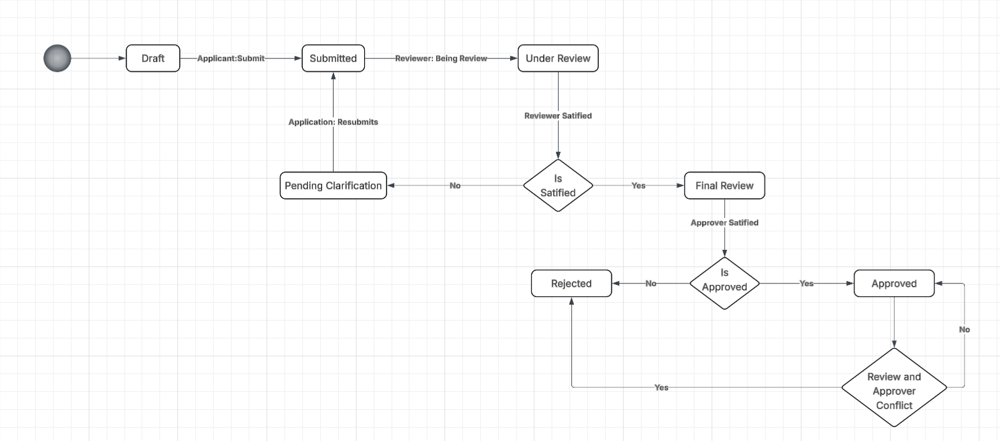
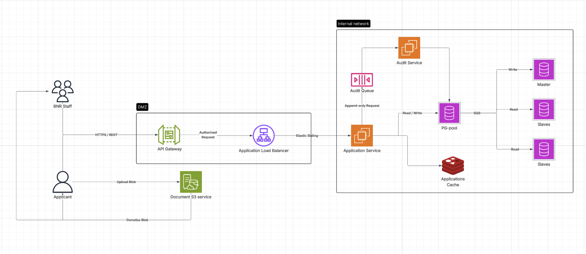
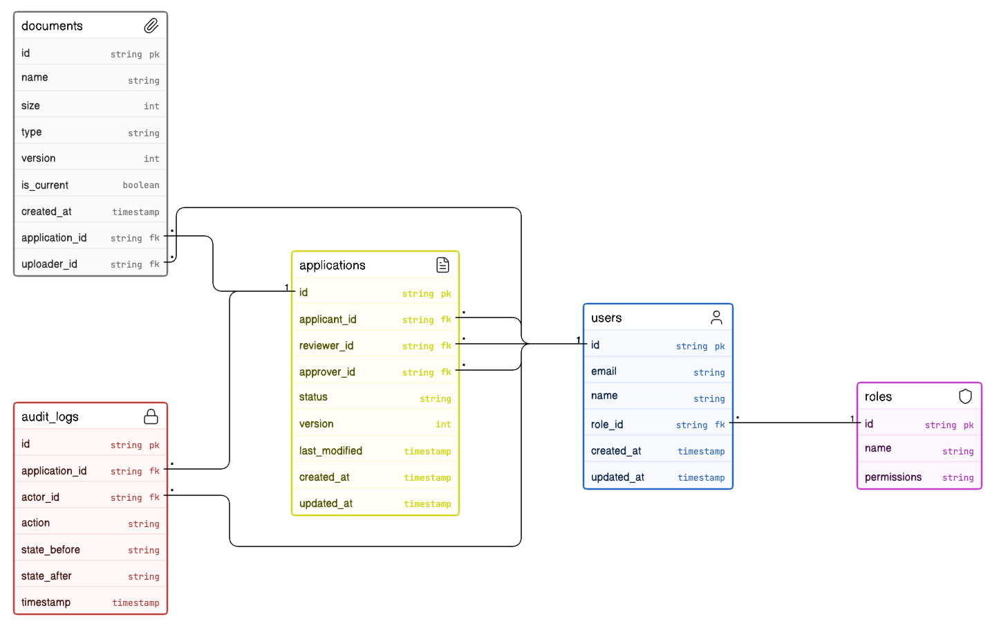

# Bank Licensing & Compliance Portal

## Overview

This system manages a controlled multi-step licensing review process between three actors: **Applicant**, **Reviewer**, and **Approver**. It enforces clear role-based transitions, keeps a complete audit trail of every state change, and stores versioned application documents.

## Workflow (State Machine)

- **Draft -> Submitted**: Applicant creates and submits an application.
- **Submitted -> Under Review**: Reviewer starts assessment.
- **Under Review -> Pending Clarification**: Reviewer requests more information.
- **Pending Clarification -> Under Review**: Applicant resubmits documents.
- **Under Review -> Final Review**: Reviewer is satisfied and escalates.
- **Final Review -> Approved / Rejected**: Approver makes final decision.

## System Design

The platform separates **public edge** traffic from **internal** services and uses async auditing plus pooled PostgreSQL access.

**Clients and documents**

- **BNR Staff** and **Applicants** call the backend over **HTTPS (REST)** via the **API Gateway**.
- **Applicants** upload blobs directly to **Document S3**; staff and applicants download blobs from the same store.

**DMZ**

- **API Gateway** terminates and authorizes traffic, then forwards authorized requests to an **Application Load Balancer** that fronts the app tier (**elastic scaling** implied).

**Internal network**

- **Application Service** handles business logic: reads/writes relational data through **PG-pool**, and uses **Applications Cache** for hot reads or session-shaped data.
- State transitions enqueue **append-only** audit work to an **Audit Queue**; an **Audit Service** consumes the queue and persists audit rows through **PG-pool**, matching the immutable audit requirement without blocking the main request path.

**Data tier**

- **PG-pool** fronts a **PostgreSQL cluster**: a **master** for writes and **replicas** for reads, supporting separation of read/write load while keeping a single source of truth for applications, users, roles, and audit metadata references.

## Data Model (ERD)

- `applications`: root entity (`applicant_id`, `reviewer_id`, `approver_id`, `status`, `version`, timestamps).
- `documents`: linked to applications; supports document versioning (`version`, `is_current`, `uploader_id`).
- `audit_logs`: immutable transition history (`actor_id`, `action`, `state_before`, `state_after`, `timestamp`).
- `users`: identity store for all actors; linked to roles.
- `roles`: role definitions and permissions (Applicant/Reviewer/Approver).
